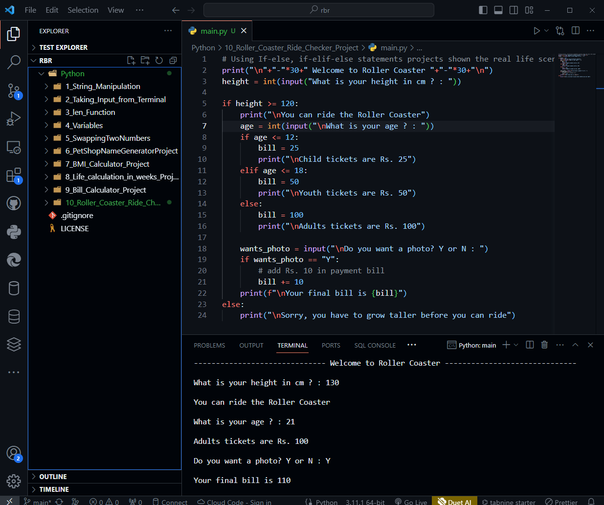

# Roll Coaster Ride Checker Project

- If will check the person who want to take the ride is eligible for it or not

- Height is the main factor for deciding whether the person is allowed to take the ride

- If person is eligible then according to the age of the person the bill are going to charged 

- If the person wants to take photo during the ride then Rs. 10 will be charged and add up to final bill.

```python
print("\n"+"-"*30+" Welcome to Roller Coaster "+"-"*30+"\n")
height = int(input("What is your height in cm ? : "))

if height >= 120:
    print("\nYou can ride the Roller Coaster")
    age = int(input("\nWhat is your age ? : "))
    if age <= 12:
        bill = 25
        print("\nChild tickets are Rs. 25")
    elif age <= 18:
        bill = 50
        print("\nYouth tickets are Rs. 50")
    else:
        bill = 100
        print("\nAdults tickets are Rs. 100")
        
    wants_photo = input("\nDo you want a photo? Y or N : ")
    if wants_photo == "Y":
        # add Rs. 10 in payment bill
        bill += 10
    print(f"\nYour final bill is {bill}")
else:
    print("\nSorry, you have to grow taller before you can ride")

```

