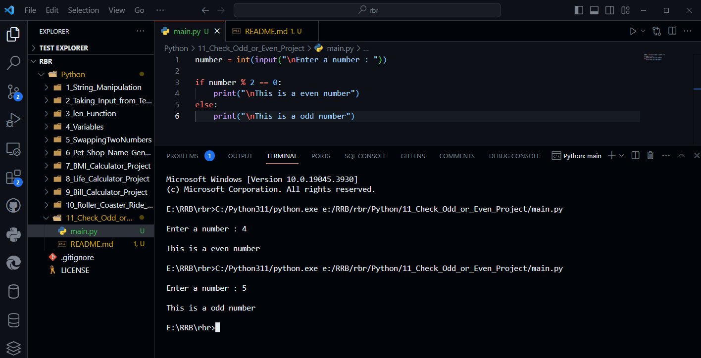

# Check whether the number is odd (or) even

```python
number = int(input("\nEnter a number : "))

if number % 2 == 0:
    print("\nThis is a even number")
else:
    print("\nThis is a odd number")
```

