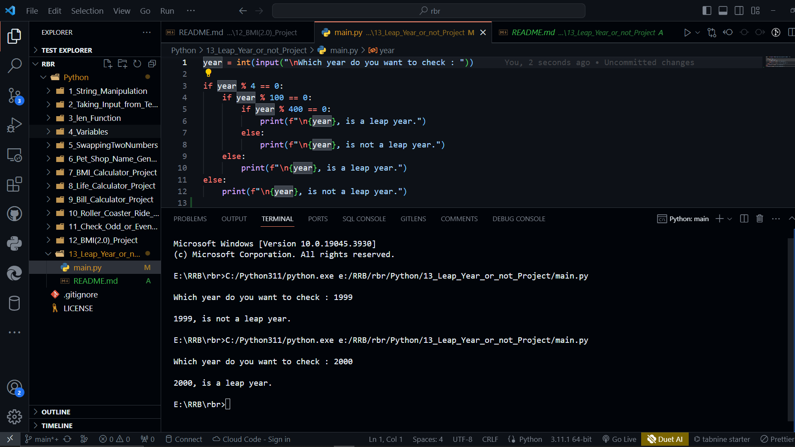

# Leap Year Project

```python

year = int(input("\nWhich year do you want to check : "))

if year % 4 == 0:
    if year % 100 == 0:
        if year % 400 == 0:
            print(f"\n{year}, is a leap year.")
        else:
            print(f"\n{year}, is not a leap year.")
    else:
        print(f"\n{year}, is a leap year.")
else:
    print(f"\n{year}, is not a leap year.")       


```


