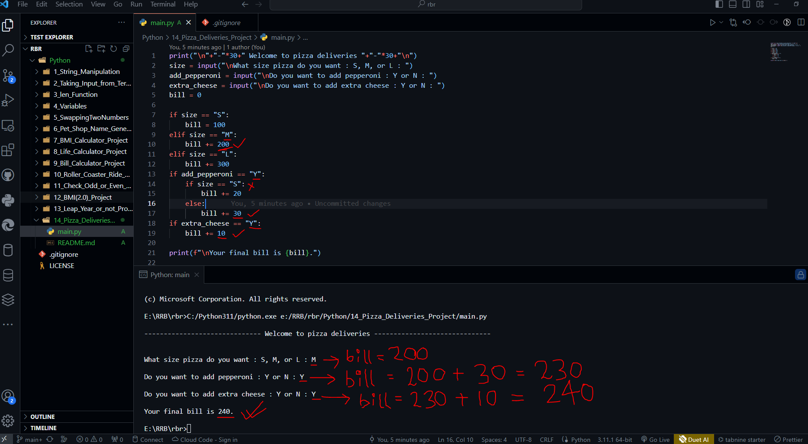

# Pizza Deliveries Project

```python

print("\n"+"-"*30+" Welcome to pizza deliveries "+"-"*30+"\n")
size = input("\nWhat size pizza do you want : S, M, or L : ")
add_pepperoni = input("\nDo you want to add pepperoni : Y or N : ")
extra_cheese = input("\nDo you want to add extra cheese : Y or N : ")
bill = 0

if size == "S":
    bill = 100
elif size == "M":
    bill += 200
elif size == "L":
    bill += 300
if add_pepperoni == "Y":
    if size == "S":
        bill += 20
    else:
        bill += 30
if extra_cheese == "Y":
    bill += 10
    
print(f"\nYour final bill is {bill}.")
    

```


