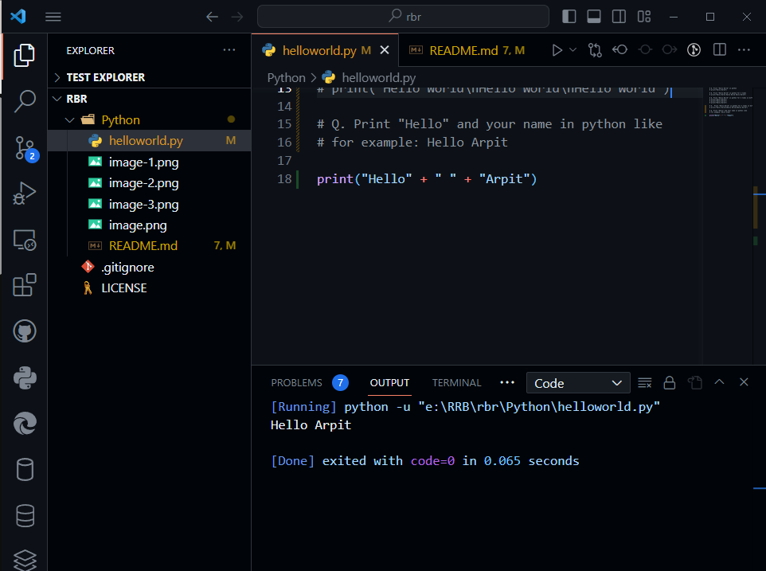

## String Manipulation

**Print "Hello World" in Python**

```python
print("Hello World)
```


**Print "Hello World" in python for 3 times**

```python
print("Hello World Hello World Hello World")
```


**Print "Hello World" in python for 3 times in different lines**

```python
print("Hello World")
print("Hello World")
print("Hello World")
```


**Print "Hello World" in python for 3 times in different lines but writtent in single statement.**

```python
print("Hello World\nHello World\nHello World")
```


**Print "Hello Arpit" in python using concatenation**

```python
print("Hello"+"Arpit")
```


**Print "Hello" and your name in python like for example: Hello Arpit**

```python
print("Hello" + " " + "Arpit")
```


**Getting Error Messages due to extra space or indentation in python**

```python
print("Hello"  + " " + "Arpit")

```

