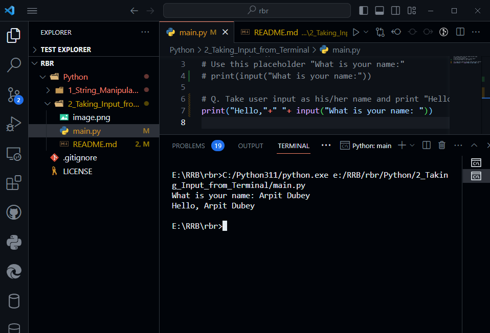

# Taking Input from user

**Taking input from user about his/her name**
**Using input() function**
**Use this placeholder "What is your name:"**

```python
print(input("What is your name:"))
```


**Take user input as his/her name and print "Hello" with user name in python**

```python

print("Hello,"+" "+ input("What is your name: "))
```
