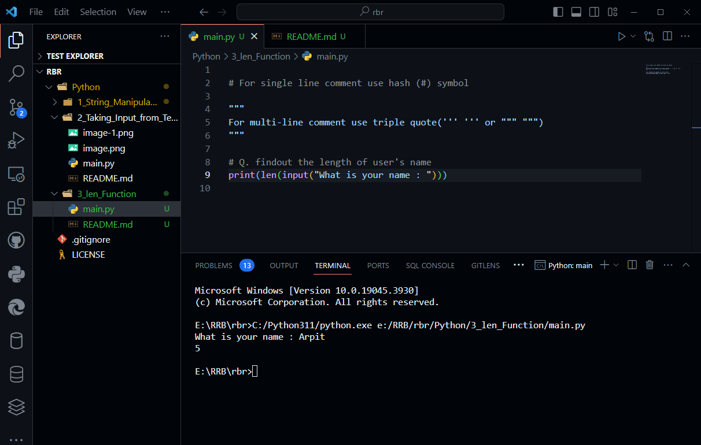

# Comment in Python

```python
# For single line comment use hash (#) symbol

"""
For multi-line comment use triple quote(''' ''' or """ """)
"""
```

# Using len() function 

**Find out the length of user's input or user's name**

```python
print(len(input("What is your name : ")))
```


