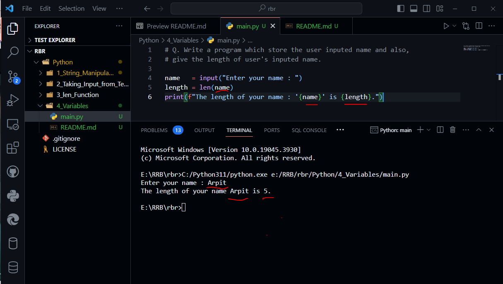

# Variables

- There is a memory and, a small part of memory storing some data and that memory has going to have an address

- To access the memory you have to need that address. 

- Variable is a name tag which is given to memory location where data is stored.


```python

name   = input("Enter your name : ")
length = len(name)
print(f"The length of your name : '{name}' is {length}.")

```



- python is **dynamically - typed** language.

- you can store mutiple data type in variable of same name.