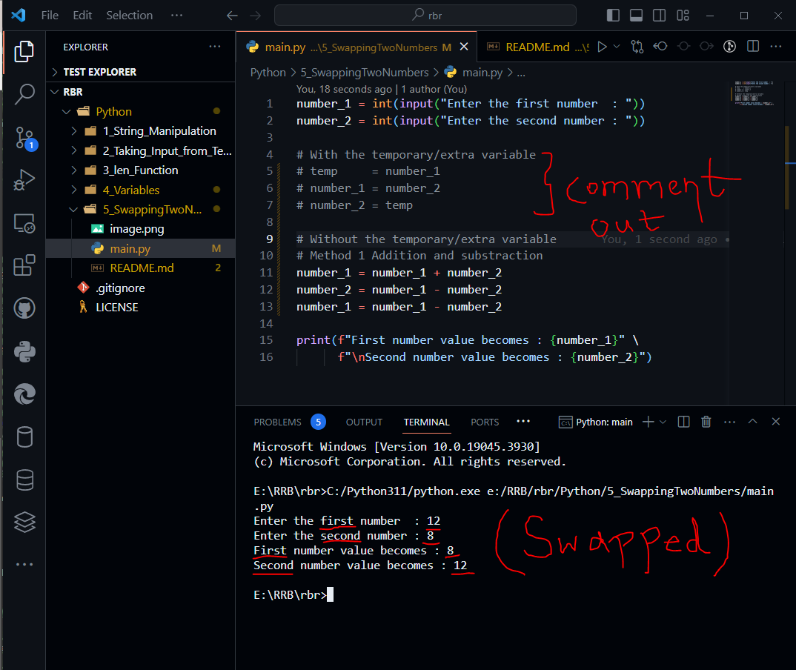

# Swapping of two numbers

**Swapping of two numbers using temporary/extra variable**

```python
number_1 = int(input("Enter the first number  : "))
number_2 = int(input("Enter the second number : "))

# With the temporary/extra variable
temp     = number_1
number_1 = number_2
number_2 = temp

print(f"First number value becomes : {number_1}" \
      f"\nSecond number value becomes : {number_2}")
```


#### Without temporary/extra variable


**Method 1: Using Addition(+) and Substraction(-)**

```python

number_1 = int(input("Enter the first number  : "))
number_2 = int(input("Enter the second number : "))

# With the temporary/extra variable
# temp     = number_1
# number_1 = number_2
# number_2 = temp 

# Without the temporary/extra variable
# Method 1 Addition and substraction
number_1 = number_1 + number_2
number_2 = number_1 - number_2
number_1 = number_1 - number_2

print(f"First number value becomes : {number_1}" \
      f"\nSecond number value becomes : {number_2}")

```



**Method 2: Using Multiplication(*) and Floor-Division(//)**

```python

number_1 = int(input("Enter the first number  : "))
number_2 = int(input("Enter the second number : "))

# With the temporary/extra variable
# temp     = number_1
# number_1 = number_2
# number_2 = temp 

# Without the temporary/extra variable
# Method 1 Addition and substraction
# number_1 = number_1 + number_2
# number_2 = number_1 - number_2
# number_1 = number_1 - number_2


# Method 2: Multiplication and floor Division
number_1 = number_1 * number_2
number_2 = number_1 // number_2
number_1 = number_1 // number_2

print(f"First number value becomes : {number_1}" \
      f"\nSecond number value becomes : {number_2}")

```

