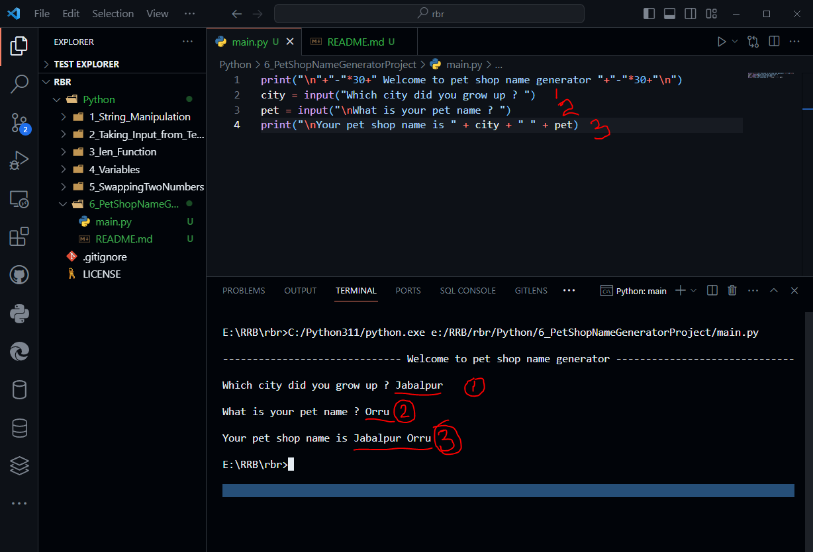

# Pet Shop Name Generator

- Creating a simple project to test previous conceputal knowledge
- Using string manipulation and Variables
- Generate pet shop name using city name and pet name


```python

print("\n"+"-"*30+" Welcome to pet shop name generator "+"-"*30+"\n\n")
city = input("Which city did you grow up ? ")
pet = input("\nWhat is your pet name ? ")
print("\nYour pet shop name is " + city + " " + pet)
```

