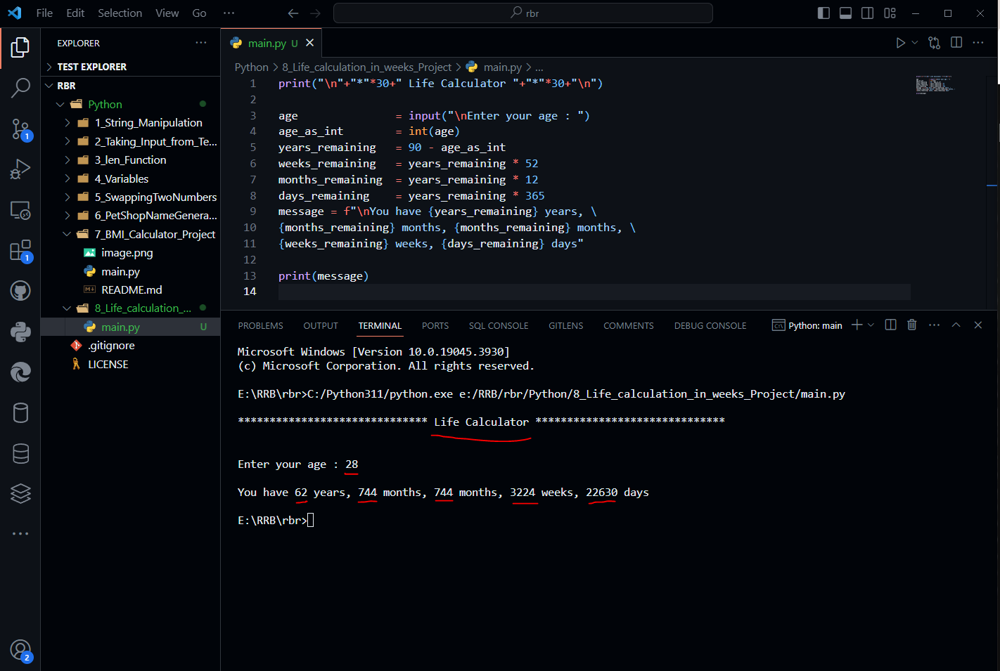

# Life Calculator

```python
print("\n"+"*"*30+" Life Calculator "+"*"*30+"\n")

age               = input("\nEnter your age : ")
age_as_int        = int(age)
years_remaining   = 90 - age_as_int
weeks_remaining   = years_remaining * 52
months_remaining  = years_remaining * 12
days_remaining    = years_remaining * 365
message = f"\nYou have {years_remaining} years, \
{months_remaining} months, {months_remaining} months, \
{weeks_remaining} weeks, {days_remaining} days"

print(message)

```

