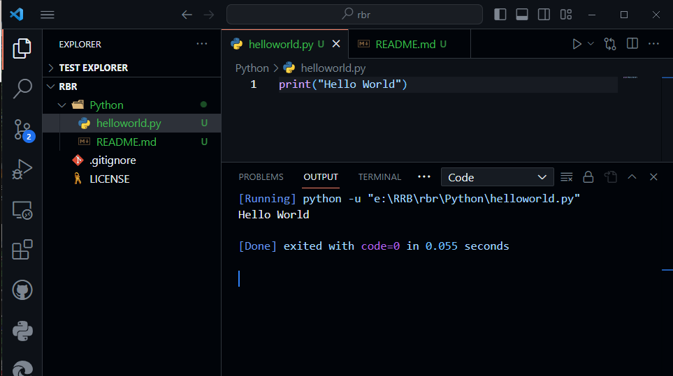
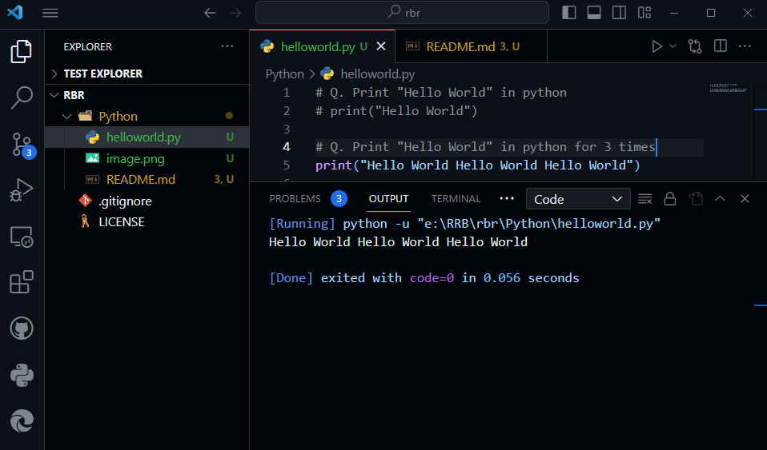
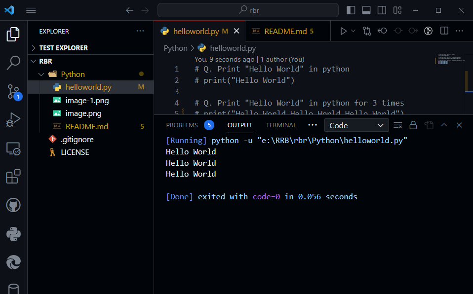
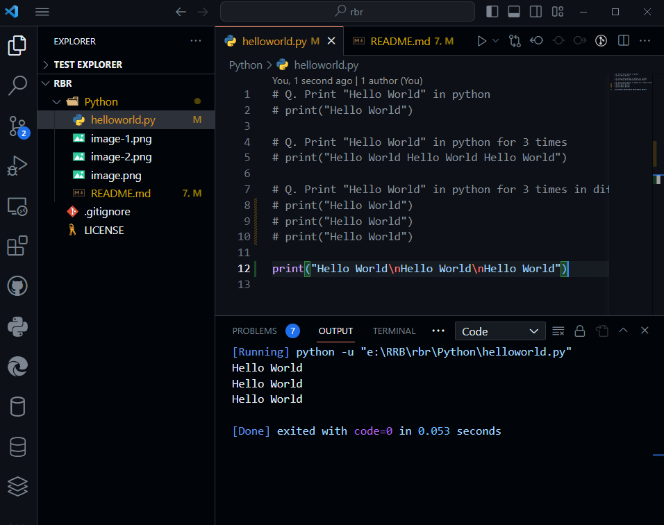

**Print "Hello World" in Python**

```python
print("Hello World)
```



**Print "Hello World" in python for 3 times**

```python
print("Hello World Hello World Hello World")
```


**Print "Hello World" in python for 3 times in different lines**

```python
print("Hello World")
print("Hello World")
print("Hello World")
```


**Print "Hello World" in python for 3 times in different lines but writtent in single statement.**

```python
print("Hello World\nHello World\nHello World")
```

